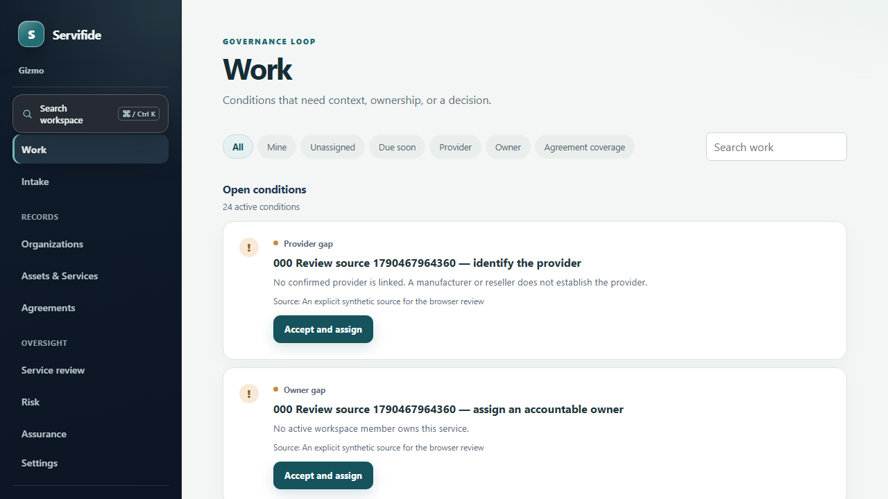
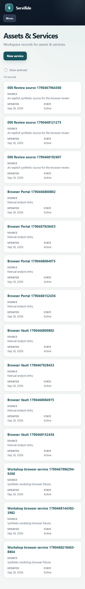

# Servifide

I started Servifide as an exploration of the work that sits alongside platforms such as Vanta and Drata: connecting evidence to the services, vendors, and agreements it relates to, then deciding what to do when something is missing. I’m interested in the intersection of day-to-day security operations, evidence, and human judgment. This is my attempt to make those relationships easier to review while leaving consequential decisions with people.

In the workflow, someone starts with a service, links it to its provider and relevant agreement, and sees where evidence or coverage is missing. A reviewer can follow source material into a proposed change, check the context, and decide whether it should become an accepted record or an action. Controls, evidence, risks, and assessments connect through the same relationships.

## Design choices
## Design choices

- **Keep relationships explicit.** A provider mention or commercial reference does not by itself prove that an agreement covers a service.
- **Separate evidence from conclusions.** Source material, suggestions, accepted relationships, computed gaps, work items, and formal decisions have distinct meanings.
- **Keep people in charge of decisions.** Automation can organize or suggest; accountable review determines what is accepted.
- **Make uncertainty visible and actionable.** Missing context is a gap to investigate, not a relationship to invent.
- **Keep core workflows useful without AI.** Optional assistance is off by default and does not own authority.

## Screens from the local demo

These screens come from a local demo with fictional names and records. They show sample workflows, not a customer environment.

**Work view:** review missing context and route gaps into accountable work.

**Responsive records view:** browse service and organization records on a narrow screen.

These examples don’t show production use, customer results, a compliance certification, or direct FedRAMP delivery.
## Licensing

No project license is granted here. Keep required third-party notices with any reused material.
