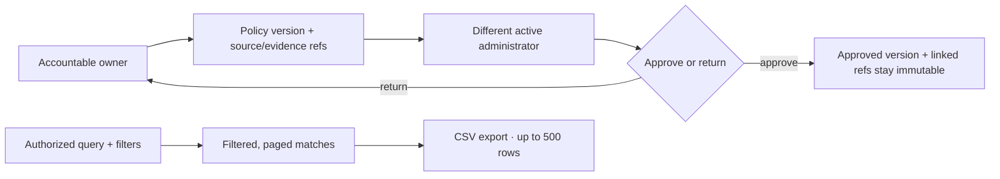

# Servifide

Servifide is my attempt to make it easier to follow the relationships between services, providers, agreements, and the work they create.

The screenshots are local browser-test captures with fictional data. They show selected workflows, not a live deployment, compliance certification, or evidence of production readiness.

## Policy review and search

### Workflow sketch

These paths summarize the fictional-data workflows shown in the local browser-test captures. This is a workflow sketch, not a deployment or architecture diagram.

### A versioned policy register

Create a policy with an accountable owner and retained source and evidence references. Submit a version to a different active administrator for approval or return; inspect its history and retire the policy when it is no longer active. Approved versions and their linked evidence references cannot be rewritten.

### Scoped search and CSV export

Search organizations, services, agreements, controls, risks, assessments, and Work. Filter results and page through matches. Download the full authorized query and filter as CSV, up to 500 rows.

## Product principles

- A provider mention or purchase reference does not prove agreement coverage
- Source material, proposals, accepted relationships, work items, and decisions stay distinct
- Automation may organize or suggest; accountable people decide what becomes an accepted record
- Core review flows remain useful without model assistance

No project license is granted here. Keep required third-party notices with any reused material.
