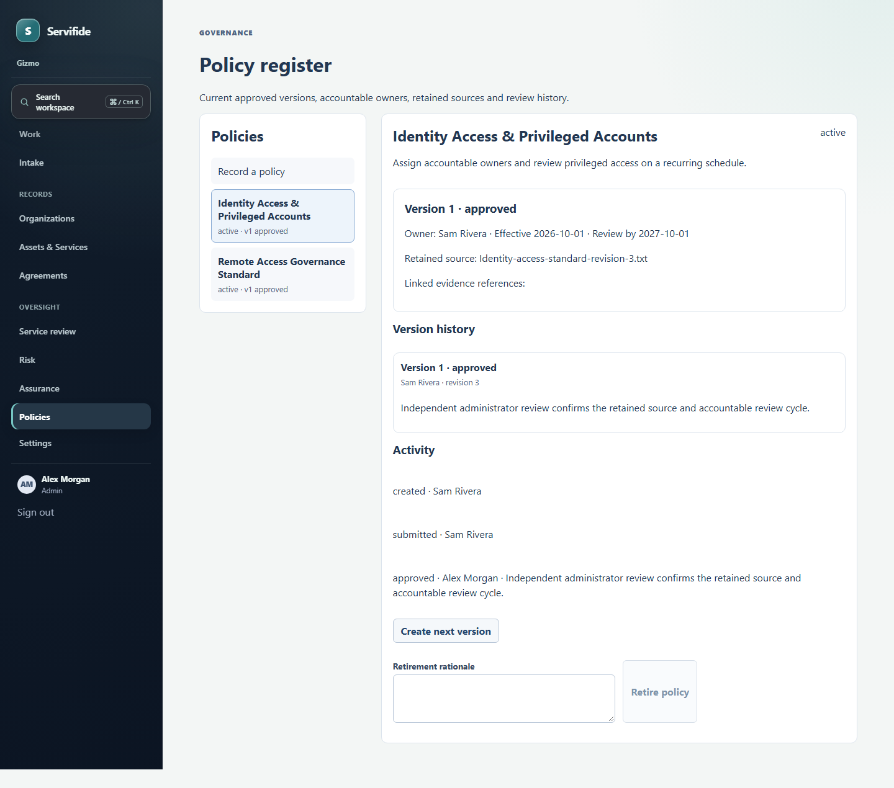
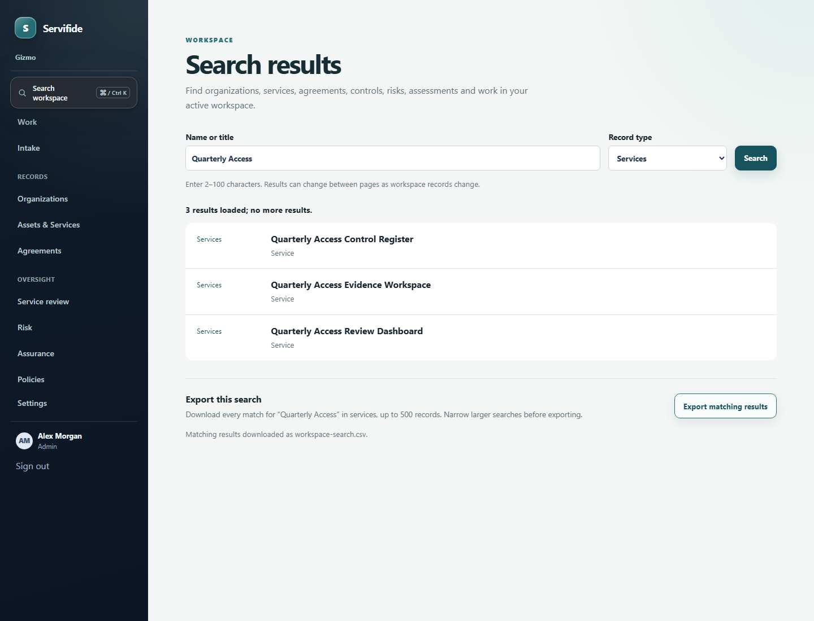

# Servifide

**Connect what you use, who you depend on, and what governs the relationship. Then make missing context actionable.**

Servifide explores a practical security-operations workflow: start with a service, follow the provider and agreement relationships that have actually been reviewed, and route open questions into accountable work.

## Policy review and search

### A versioned policy register

Create a policy with an accountable owner and retained source and evidence references. Submit a version to a different active administrator for approval or return; inspect its history and retire the policy when it is no longer active. Approved versions and their linked evidence references cannot be rewritten.

### Scoped search and CSV export

Search organizations, services, agreements, controls, risks, assessments, and Work. Filter results and navigate stable pages. Download the full authorized query and filter as CSV, up to 500 rows.

## Product principles

- A provider mention or purchase reference does not prove agreement coverage
- Source material, proposals, accepted relationships, work items, and decisions stay distinct
- Automation may organize or suggest; accountable people decide what becomes an accepted record
- Core review flows remain useful without model assistance

## Demo boundaries

These screenshots are local browser-test captures with fictional data. They show specific workflows, not a live deployment, compliance certification, or evidence of production readiness.

No project license is granted here. Keep required third-party notices with any reused material.
