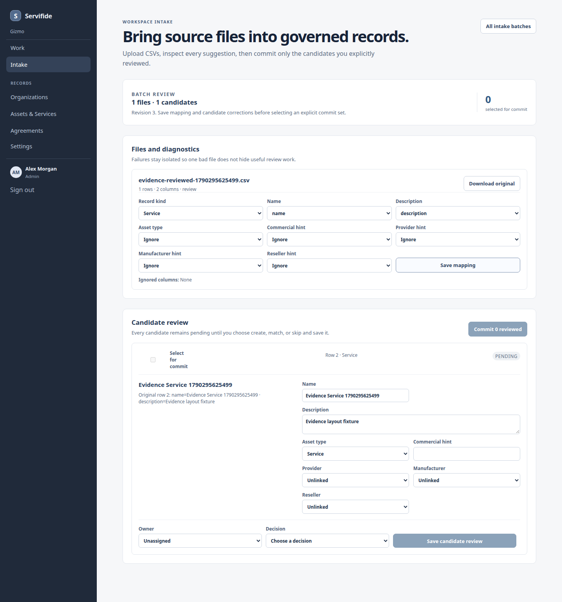
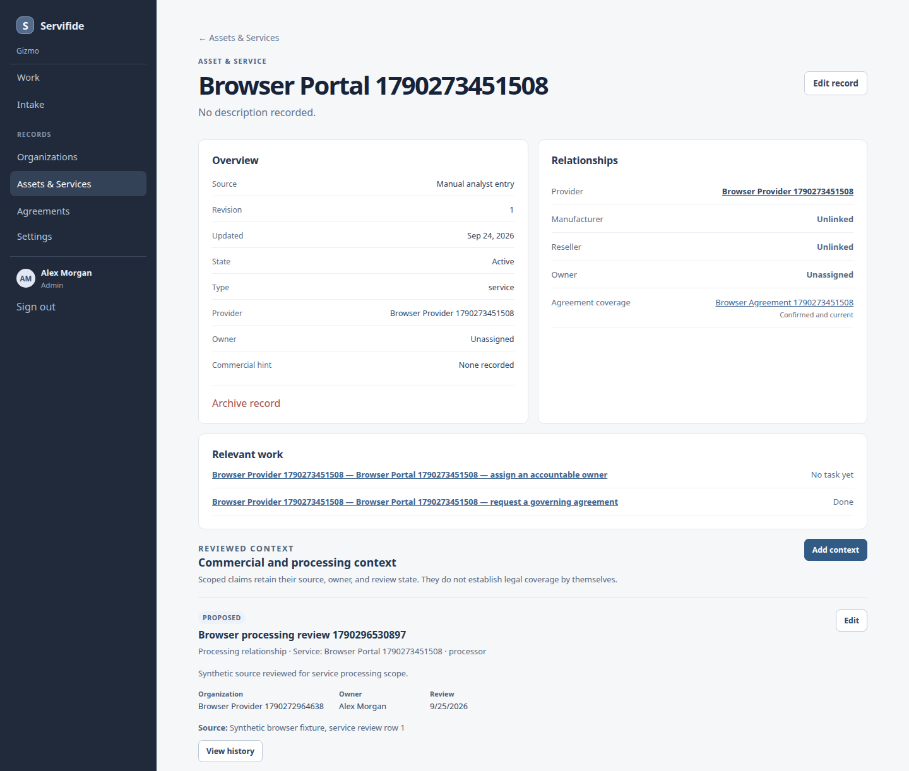
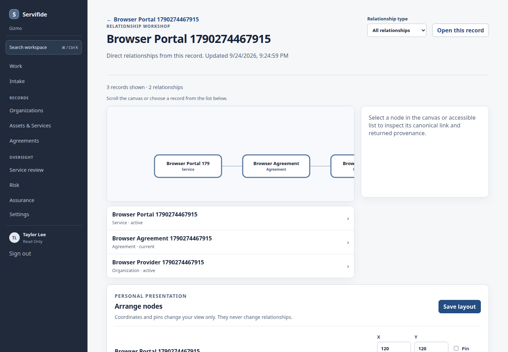

# Servifide

**Connect what you use, who you depend on, and what governs the relationship. Then make missing context actionable.**

Servifide explores a practical security-operations workflow: start with a service, follow the provider and agreement relationships that have actually been reviewed, and route open questions into accountable work.

## A quick look inside

### Work that points to a next step

Review missing provider, owner, or agreement context in one queue. A commercial hint stays a hint until someone confirms the relationship.

### Source files, reviewed before they become records

Map fields, inspect candidate rows, and choose what should be created, matched, or skipped before committing an import.

### A service, with its context in view

See the provider, agreement coverage, relevant work, and source-linked context together without collapsing them into one status.

### Relationships you can inspect

Explore direct connections among a service, its provider, and an agreement while keeping the scope of the view clear.

## Product principles

- A provider mention or purchase reference does not prove agreement coverage
- Source material, proposals, accepted relationships, work items, and decisions stay distinct
- Automation may organize or suggest; accountable people decide what becomes an accepted record
- Core review flows remain useful without model assistance

## Demo boundaries

These are archived screenshots from local browser tests with fictional data. Some test captures retain generated labels and IDs; none show a customer environment. They are not a live deployment, compliance certification, or evidence of production readiness.

No project license is granted here. Keep required third-party notices with any reused material.
